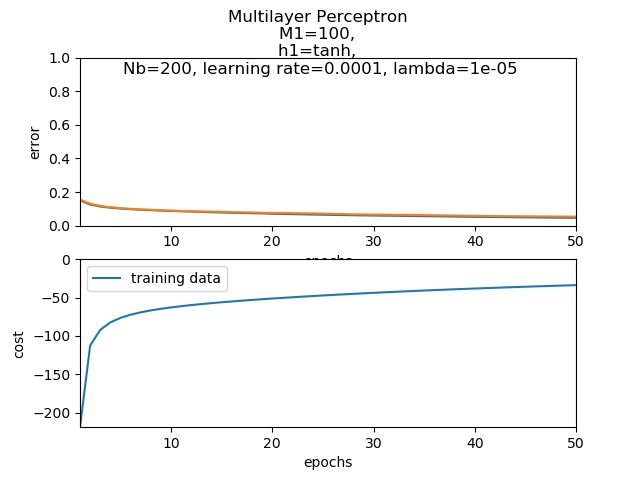
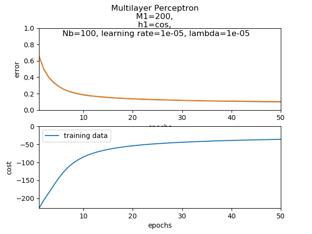

# Classification MLP

## Introduction
Machine Learning classification based on Stochastic Gradient Ascent with one or more hidden layers.  
Runs in two different cases:
1. MNIST  
Data taken from aueb e-class ([here](https://eclass.aueb.gr/modules/document/index.php?course=INF267&openDir=/5342e7c43dh6)).
2. CIFAR-10  
Data taken from toronto edu ([here](https://www.cs.toronto.edu/~kriz/cifar.html)).

## Usage
To use this Multi Layer Perceptron implementation, user has to:
1. Create a `MultiLayerPerceptron` object. 
2. Call `add` method to add `HiddenLayer` object in the MLP containing plenty of parameters.
3. Call  `compile` method to add the hyper-parameters.
4. Fit the the model by calling `fit` with parameters (size of batch from SGA etc).
5. Call `predict` giving the testing set.
6. Call `score` to compute error between predicted test values and real test values. 

## Network
A specific example for the given project can be captured by two diagrams. The diagram is not 100% representative as a column is added in some cases, but responces to the generic idea.  

  
  
The below diagram was produced for **back propagation** needs. The `h` fucntion can be `softplus`, `tanh`, or `cos`.  
`ONE` can be considered as a column vector with all its' elements' values be equal to `1`.   

## Maths
There are some algebra calculations, in order to compute the last hidden layer weight cost derivatives based on back propagation. You can track them [here](report/math_back_propagation.ipynb). 

## Parameters
Given the mini-batch, the hidden units amount, the epochs to run, development set percentage, the model runs through some given lamda (weight regularization) values and learning rate values, peaking the lowest developments' score error model and the epoch in which it was calculated. This model afterwards, is the chosen model, to be used in test set predictions.

## Outcome 
1. MNIST  
For MNIST data, the outcome was quite positive as the models' validation predictions had in most cases less than 20% error after the 20th epoch. For the same function, mini-batch, hidden layer units and lambda, lower learning rate seems to act better in the model. As expected, for mini-batch higher values, the model has higher error in the same amount of epochs, but it's being trained faster. When having larger hidden units, the model has higher error percentage because it needs more data and more epochs to update the weights properly. As for the functions, `tanh` seems to be the best with `softplus` and `cos` having almost the same results. Lambda (weight regularization) = 0.0001 was almost identical for the least error percentage in development set in comparison to other values.  

2. CIFAR-10  
For CIFAR-10 data, the outcome was quite frustrating. The one hidden layer models' predictions in validation set -and even in training set- had 50% ~ 60% error. This makes sense as this classification problem is quite more difficult comparing to MNIST. The model is too simple and the data may be few to get a better approach in this task. The interesting part can be found in the prefered learning rate value. Comparing to MNIST, in CIFAR-10 higher learning rate values fits the model in a better way.  

## Notes
Hypothetically speaking, this model should work for plenty of hidden layers, but it sure does work with **one hidden layer**!
