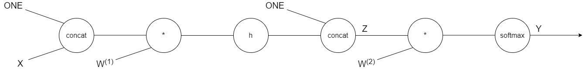

# Classification MLP

## Introduction
Machine Learning classification based on Stochastic Gradient Ascent with one or more hidden layers.  
Runs in two different cases:
1. MNIST  
Data taken from aueb e-class ([here](https://eclass.aueb.gr/modules/document/index.php?course=INF267&openDir=/5342e7c43dh6)).
2. CIFAR-10  
Data taken from toronto edu ([here](https://www.cs.toronto.edu/~kriz/cifar.html)).

## Usage
To use this Multi Layer Perceptron implementation, user has to:
1. Create a `MultiLayerPerceptron` object. 
2. Call `add` method to add `HiddenLayer` object in the MLP containing plenty of parameters.
3. Call  `compile` method to add the hyper-parameters.
4. Fit the the model by calling `fit` with parameters (size of batch from SGA etc).
5. Call `predict` giving the testing set.
6. Call `score` to compute error between predicted test values and real test values. 

## Network
A specific example for the given project can be captured by two diagrams.  

  
  
The below diagram was produced for **back propagation** needs. The `h` fucntion can be `softplus`, `tanh`, or `cos`.  
`ONE` can be considered as a column vector with all its' elements' values be equal to `1`.   

## Maths
There are some algebra calculations, in order to compute the last hidden layer weight cost derivatives based on back propagation. You can track them [here](report/math_back_propagation.md). 

## Notes
Hypothetically speaking, this model should work for plenty of hidden layers, but it sure does work with **one hidden layer**!
