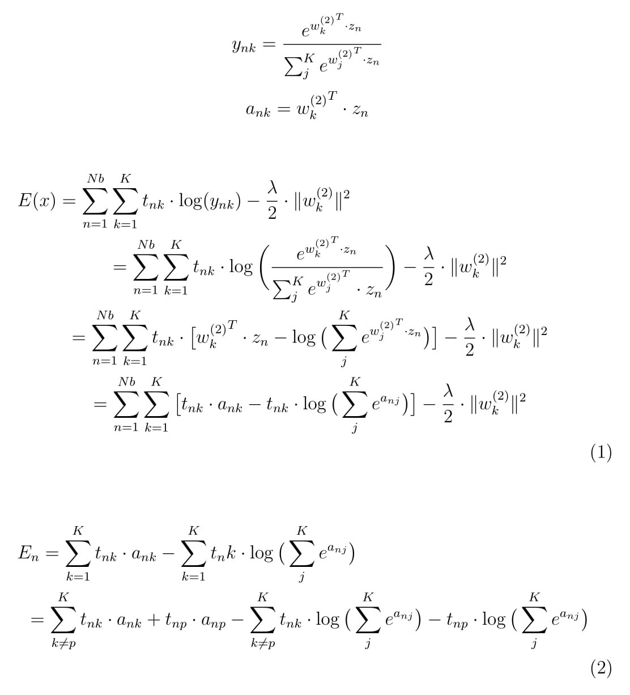
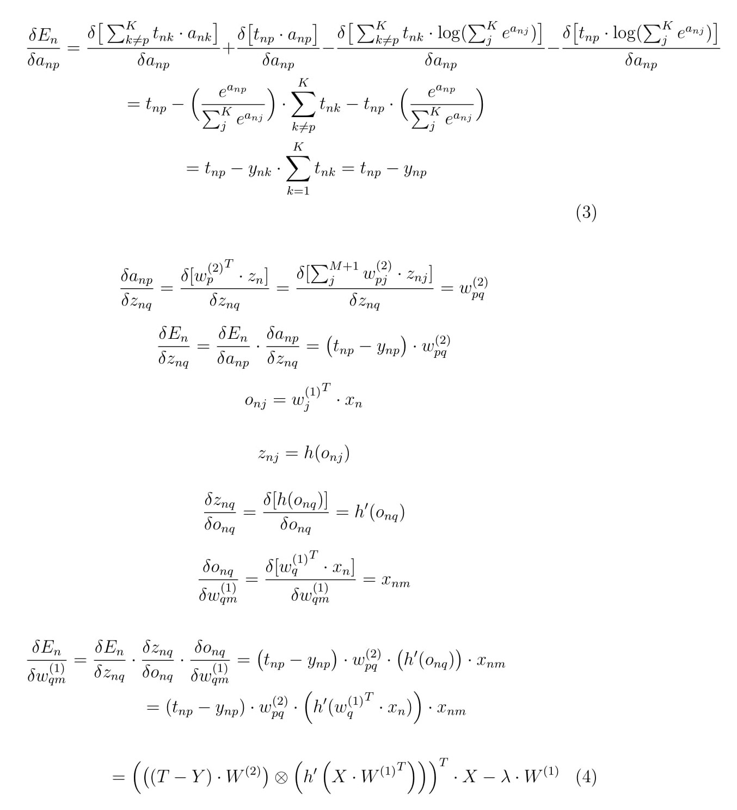

# Hiddens' layer weight cost derivative.
The computation for hiddens' layer weight cost derivative was based on back propagation and chain rule. There are some variables defined as to be more simple. The `h` function can be `softplus`, or `tanh`, or `cos`.    

