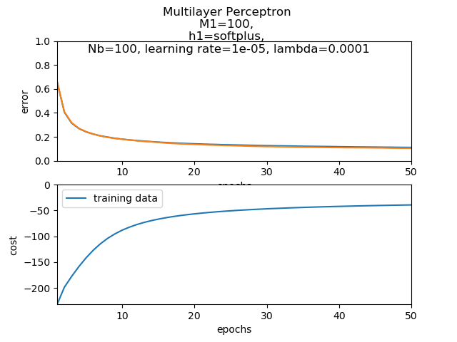
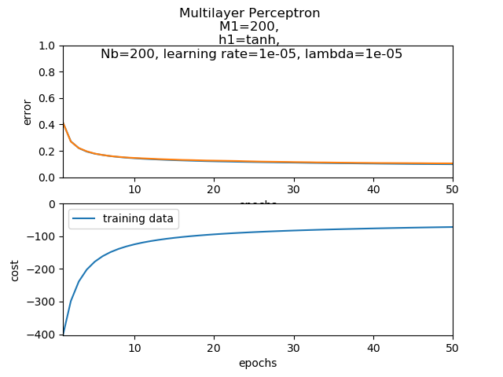
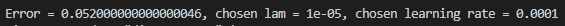
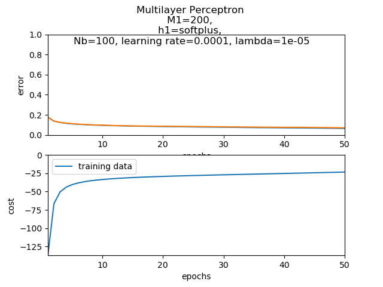
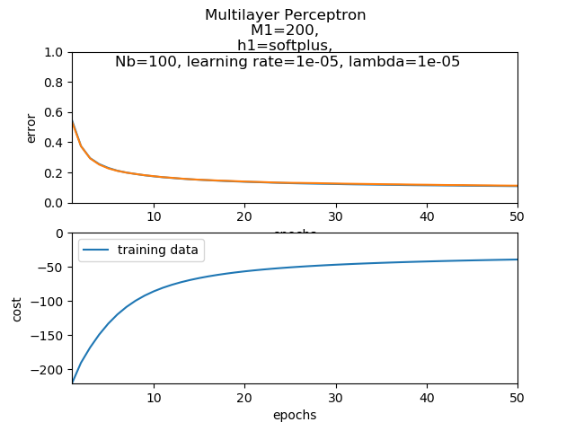
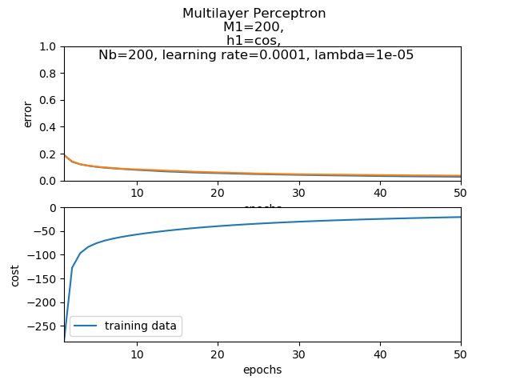
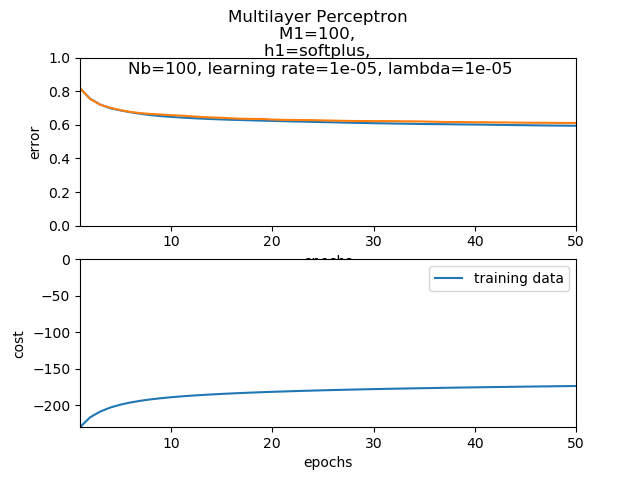
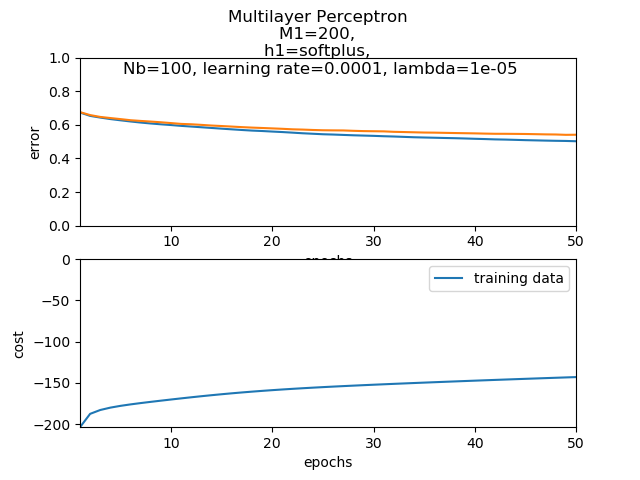

# Outcome 
The outcome differs depending on the problem to be solved and its' difficulties.  

1. MNIST  
For _MNIST_ data, the outcome was quite positive as the models' validation predictions had in most cases less than 20% error after the 3th epoch. For the same function, mini-batch, hidden layer units and lambda, higher `learning rate` (~0.0001) seems to act better in the model because it learns faster this easy problem. For `mini-batch` higher values, the model has almost identical behaviour as for lower values, but it's being trained faster. The same stands for hiddens' layers' units amount too, it does not effect the results in a considerable way. As for the functions, `tanh`, `softplus` and `cos` seems to have the same behaviour too. `Lambda` (weight regularization) = 0.001 in general but any similar value would act almost the same and sometimes ever better. With all being said, the only parameter that changes the result is the learning rates' value for the first epochs to run but the final output for lot of epochs will be ~identical.

_First specific example_  

  
_Test data output:_  
  

_Second specific example_  

  
_Test data output:_  
  

_Random diagrams_  

2. CIFAR-10  
For _CIFAR-10_ data, the outcome was quite frustrating. The one hidden layer models' predictions in validation set -and even in training set- had 50% ~ 60% error. This makes sense as this classification problem is quite more difficult comparing to _MNIST_. The model is too simple and the data may be few to get a better approach in this task. As _MNIST_, the only parameter which seems to change the result is the `learning rate` value, where higher values (~0.0001) seems to act better than lower ones (~1e-05). 

_Random diagrams_  

  

## Note
The orange model in diagrams representes the __developlment set__.